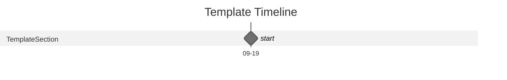

# {{title}}

Date: MM/DD/YYYY

## Overview

## Deliverables

## Assumptions

## Methodology

## Timeline

## Budget

| Part     | Desx.   | Cost |
| -------- | ------- | ---- |
| template | temlate | $1   |
